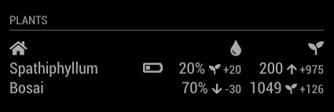

# MMM-MiFlora

This is a MM Module for the Xiaomi Mi Flora.



## Prerequest
Follow Noble Prerequest https://github.com/noble/noble#prerequisites

Or use this Raspberry summary

### Install packages
```
sudo apt-get install bluetooth bluez libbluetooth-dev libudev-dev
```

### Run without sudo
```
sudo setcap cap_net_raw+eip $(eval readlink -f `which node`)
```

## Install
```
npm install
```

### Test connection
```javascript
// The easiest way
node ble_wrapper.js

// With debugger
DEBUG=miflora* node ble_wrapper.js

/**
 * Available Arguments
 * --duration=30 Discovery duration in sec
 * --interval=30 Sensordata update interval in min
 * --address=c4:7c:8d:65:e7:22 Mac adress of the sensor. You can use it multiple times
 * --address=c4:7c:8d:65:e7:23 Mac adress of the sensor. You can use it multiple times
 */
DEBUG=miflora* node ble_wrapper.js --duration=20 --interval=30 --address=c4:7c:8d:65:e7:22
```

### Setup Module
To use this module, add it to the modules array in the `config/config.js` file:

```javascript
modules: [
  {
    module: "MMM-MiFlora",
    position: "top_left",
    header: "My Plants",    // Header (optional)
    config: {
      updateInterval: 30,   // Update Interval in minutes (default=30)
      sendIndoorTemp: true, // Sends the tempreture to the weather module (default=false)
      indoorTempSensor: 1,  // Sensor to use for indoor tempreture. It's used if sendIndoorTemp is true	
      sensors: [            // Array of all your Sensors. It's empty by default
        {
          address: "c4:7c:8d:63:18:23",
          name: "Einblatt",
          moistureMin: 15,   // in %
          moistureMax: 65,   // in %
          fertilityMin: 350, // in µS/cm
          fertilityMax: 2000 // in µS/cm
        },
        {
          address: "c4:7c:8d:65:e6:20",
          name: "Bosai",
          moistureMin: 20,   // in %
          moistureMax: 60,   // in %
          fertilityMin: 350, // in µS/cm
          fertilityMax: 2000 // in µS/cm
        }
      ]
    }
  },
]
```
